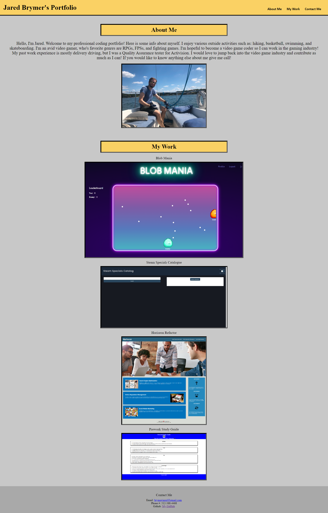

# <work-portfolio>

## Description

I wanted to create this portfolio to show potential employers. This portfolio will be helpful to show my current and future works, and helps me become better with my html and css skills. I learned how to flex wrap a page, and how to create boxes around text. This project also showed me how useful pseudo coding is.

## Installation

N/A

## Usage

Showing potential employers my skills and how to contact me.

## Credits

CSS Borders: https://www.w3schools.com/css/css_border.asp

# License

Please refer to the LICENSE in the repo.